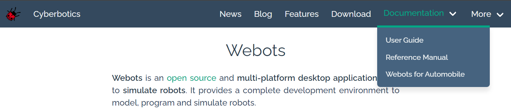

# MTRN2500 - Lab07-2 (Webots I)

## Learning Outcomes

- Have done lab 0.
   - Installed Webots.
   - Can navigate the Webots GUI.
   - Understand the components of the Webots folder structure.
   - Appreciate the relevance of robot simulators in robot design.
- Can navigate Webots documentation.
- Can use Webots documentation to independently discover and use devices.
- Can create a controller in Webots.
- Can use Webots' GCC build tool.
- Understands the purpose of `webots::Robot::step()` function.
- Can use velocity control for a motor.
- Can use blocking timers as a basic synchronisation technique.
- Understands how to use position motor control.
    - Can use the position sensor to set relative positions.
    - Can apply the arc formula to calculate set positions.
- Can structure and compile a multi-file Webots controller.
- Can use `webots::Keyboard` to velocity control a robot.

---

## Prerequisites

1. Do [lab0-webots](https://gitlab.com/dennuguyen/mtrn2500-2022t3/-/tree/master/lab0-webots).
1. Install [Webots 2021b](https://github.com/cyberbotics/webots/releases).

---

## Exercise: Hello Webots

Create a C++ controller called `hello_webots`.


Write a simple "Hello Webots!" program that prints to the Webots console.


Modify the `Makefile` so that it includes the following compilation flags:
```
CFLAGS = -std=c++14 -Wall -Werror
```


Compile the controller.


Attach the controller to the robot.


Run the controller.


---

## Exercise: Navigating Documentation

An important skill of using Webots is being able to navigate their documentation at https://cyberbotics.com.



Find the E-Puck robot documentation.


Find the `Keyboard` class documentation.


Find the `Motor` class documentation. Find the documentation for the `setVelocity()` method.


Find the `Robot` class documentation. Find the documentation for the `step()` method.


---

## Exercise: Simulated Controller

What are some real-life examples of robot controllers/micro-controllers? Do these controllers run in discrete or continuous time?


How does Webots simulate the instruction cycles of a controller? Create a controller, `simulated_controller`, which cycles every `256 ms` and prints an incrementing value.

> Don't forget to repeat the build process outlined in [Exercise: Hello Webots](#exercise-hello-webots).


What happens to the controller if the `duration` is increased (`1000 ms`) or decreased (`64 ms`)?


---

## Exercise: Velocity Motor Control

Webots provides a class interface for controlling motors.

There are two main types of motor control:
- Position control: Controls the angular rotation of the motor.
- Velocity control: Controls the angular velocity of the motor.

Create a controller, `velocity_motor_control`, so that the robot: 
- Moves forward at its maximum speed when the `moveForward()` function is called.

> A starter file has been provided for you.

> Don't forget to repeat the build process outlined in [Exercise: Hello Webots](#exercise-hello-webots).


It is possible to control *when* to move. A basic synchronisation technique would be to use a blocking timer.
```cpp
while (robot.step(duration) != -1) {  // Loops forever until the controller exits.
    moveForward(leftMotor, rightMotor);
    wait(robot, 1000);  // Milliseconds.
    halt(leftMotor, rightMotor);
    wait(robot, 1000);
}
```

> The `wait()` function has been implemented for you.

Complete the `velocity_motor_control` controller so that the robot will loop through the following states:
- Moves forward at its maximum speed for `1 s`.
- Moves backwards at half the robot's maximum speed for `2 s`.
- Turns left on the spot at half the robot's maximum speed four times for `1 s`.


---

## Revision: Arc Formula

The arc formula is `s = r * theta`.

For a two-wheeled robot (i.e. the E-Puck), how much should each wheel spin (in radians) for the robot to travel a distance of `1 m`?


---

## Exercise: Position Motor Control

Create a controller, `position_motor_control`, so that the robot:
- Moves forward for `0.5 m`.


It is important to note that `webots::Motor::setPosition()` is a non-blocking function i.e. it will execute and return immediately while the motion can still happen.


The angular position given to `webots::Motor::setPosition()` represents the absolute angular position relative to the initial position when the controller was instantiated. To set a relative angular position from the current position of the motor, a [position sensor](https://cyberbotics.com/doc/reference/positionsensor?tab-language=c++) is required.


Complete the `position_motor_control` so that the robot will loop through the following states:
- Moves forward for `0.5 m`.
- Moves Backwards for `0.5 m`.
- Turns right on the spot for `90 deg`.


---

## Multi-File Webots Controllers

It is likely that your Webots controllers will require multiple `.cpp` and `.hpp` files. A controller may even be dependent on another controller's files. Consider the following Webots controllers folder structure:
```
controllers/
|
|_ velocity_motor_control/
|  |_ include/
|  |  |_ velocity_functions.hpp
|  |
|  |_ src/
|  |  |_ velocity_functions.cpp
|  |
|  |_ Makefile
|  |_ velocity_motor_control.cpp
|
|_ keyboard_control/
   |_ keyboard_control.cpp
   |_ Makefile
```

To compile `velocity_functions.cpp`, the `velocity_motor_control/Makefile` would need to be modified:
```make
CXX_SOURCES = velocity_motor_control.cpp src/velocity_functions.cpp
INCLUDE = -I"/include"
```

If another controller e.g. `keyboard_control` is dependent on `velocity_functions.cpp`, then `keyboard_control/Makefile` would also need to be modified:
```make
CXX_SOURCES = keyboard_control.cpp ../velocity_motor_control/src/velocity_functions.cpp
INCLUDE = -I"../velocity_motor_control/include"
```

---

## Exercise: Keyboard Control

A common functionality of robots is its ability to be teleoperated i.e. remote controlled. Webots has a class called `webots::Keyboard` which allows this functionality.


Create a controller, `keyboard_control`, which uses the keyboard to move the robot (by velocity control) with the following commands:
- `'w'`: Moves the robot forward.
- `'a'`: Turns the robot left.
- `'s'`: Moves the robot backward.
- `'d'`: Turns the robot right.
- `' '`: Stops the robot.

Print to `std::cout` what key has been pressed.

> Repeat the documentation research process from [Exercise: Velocity Motor Control](#exercise-velocity-motor-control) and [Exercise: Position Motor Control](#exercise-position-motor-control) for `webots::Keyboard`.


---

## Challenge: Non-Blocking Timer

The timer presented in [Exercise: Velocity Motor Control](#exercise-velocity-motor-control) has the issue of blocking the controller from executing any actions while the timer is running. This is inefficient.

Implement a non-blocking timer using the provided table specification. Write a new control loop that demonstrates the usage of `Timer`.

<table>
    <tr>
        <th>Method</th>
        <th>Description</th>
        <th>Usage</th>
        <th>Exceptions</th>
    </tr>
    <tr>
        <td><code>Timer(webots::Robot const& robot)</code></td>
        <td>Constructor which takes a <code>robot</code> to get access to <code>webots::Robot::getTime()</code>. </td>
        <td><pre><code>webots::Robot r;
Timer t(r);</code></pre></td>
        <td>None</td>
    </tr>
    <tr>
        <td><code>void time(double const duration)</code></td>
        <td>Starts the timer at the current timestep, <code>start</code>, of <code>robot</code>. Both <code>start</code> and <code>duration</code> (in milliseconds) is saved in <code>*this</code>.</td>
        <td><pre><code>webots::Robot r;
Timer t(r);
t.time(10);</code></pre></td>
        <td>None</td>
    </tr>
    <tr>
        <td><code>bool expired() const</code></td>
        <td>Returns true if the current timestep of <code>robot</code> is greater than <code>start + duration</code>. Otherwise, false.</td>
        <td><pre><code>webots::Robot r;
Timer t(r);
t.time(10);
if (t.expired());</code></pre></td>
        <td>None</td>
    </tr>
    <tr>
        <td><code>void wait(double const duration)</code></td>
        <td>A blocking timer which uses <code>time()</code> and <code>expired()</code>.</td>
        <td><pre><code>webots::Robot r;
Timer t(r);
t.wait(10);</code></pre></td>
        <td>None</td>
    </tr>
    <tr>
        <td><code>friend std::ostream& operator&lt;&lt;(std::ostream& os, Timer const& timer)</code></td>
        <td>Writes to <code>os</code> the <code>start</code> and <code>duration</code>.</td>
        <td><pre><code>webots::Robot r;
Timer t(r);
t.time(10);
std::cout &lt;&lt; os;</code></pre></td>
        <td>None</td>
    </tr>
</table>


---
<!-- 
## Challenge: Create a Webots World

Create a new Webots world file that contains:
- Lighting.
- Background.
- Floor.
- Some objects.
- A robot.

---

## Challenge: Create a Robot

Create a robot with:
- 4 wheels.
- 1 2D LiDAR scanner.

--- -->

## Feedback

If you liked or disliked anything about the labs, please leave some [feedback](https://forms.office.com/r/sV4X0xR7dT)!
