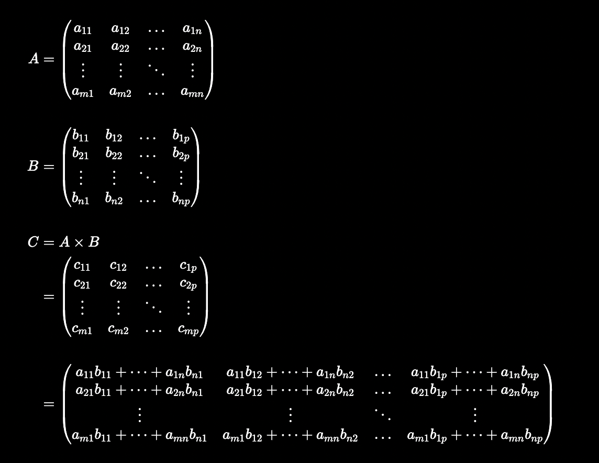

# MTRN2500 - Assignment 1 (Small Matrix)

## 1 Changes

Any changes to the specification will be listed here with the date of change.

- `2022/10/11`: Reclarify `operator!=`.
- `2022/10/10`: Fix the range of `insertRow` and `insertCol`.
- `2022/10/10`: Fixed `eraseCol` and `const` method tests.
- `2022/10/10`: Correct `operator!=` description.
- `2022/10/05`: Update progress check deadline to be 14/10/2022.
- `2022/10/05`: Minimise number of tests to avoid memory overflow. Clean up README section 5 and 6.
- `2022/10/05`: Give `catch2` option and instruct how to isolate test cases.
- `2022/10/04`: Removed `-fsanitize=address` flag because it may not be supported by everyone.
- `2022/10/03`: Added `-fsanitize=address` flag to compile command for extra safety.
- `2022/10/03`: Fix 2D initialiser list constructor where it used `reserve` instead of `resize`.
- `2022/10/03`: Fix online testing environment.
- `2022/10/01`: Link online testing environment.
- `2022/10/01`: Fix `eraseRow` and `eraseCol` subcases.
- `2022/10/01`: Clarify expected format for `operator<<()`.
- `2022/10/01`: Define `SmallMatrix` methods with dummy return values in `SmallMatrix.cpp`.
- `2022/09/28`: Fix link to style guide and remove friend function style requirement.
- `2022/09/27`: Fixed comparison of `int` and `unsigned` for `gcc` compiler.
- `2022/09/27`: Changed all references of `double const&` to `double`.

## 2 Learning Outcomes

The purpose of this assignment is to consolidate the C++ concepts taught in weeks 1, 2, 3, and 4. The main learning outcomes are:
- Appreciate the effectiveness of classes in encapsulating behaviour.
- Understand the different types of constructors, how they are implemented, and used.
- Appreciate operator overloading, and understand how these functions are implemented and used.
- Know the difference between `const` and non-`const` methods, how they are implemented, and their significance.
- Know the difference between stack and heap memory, the advantages and disadvantages of both, and how `std::array` and `std::vector` are allocated under-the-hood.
- Familiar with the usage and documentation of `std::array` and `std::vector`.
- Appreciate STL algorithms and their appropriateness over for loops.
- Know how to write exceptions and appreciate their effectiveness in writing correct code.
- Introduced to a simple testing framework to encourage mechatronics students to be methodical and efficient in testing correctness.

## 3 Task

A `SmallMatrix` is a small-storage-optimised matrix whose elements are allocated on the stack if the number of elements is less than 144 allowing fast read/write speeds. If the number of elements is 144 or greater, then its contents are allocated on the heap. Accessing heap memory is slower than accessing stack memory due to the extra level of indirection of accessing heap-allocated data by first looking up its address on the stack.

When the size of the `SmallMatrix` increases above its small-size threshold, it is able to switch from being stack-allocated to heap-allocated. However, when the size of the `SmallMatrix` decreases below its small-size threshold, it **remains** heap-allocated as there are no real-life performance benefits to be gained from switching back-and-forth between memory spaces.

The task is to implement a `SmallMatrix` class as required by the given [specification](#specification). The interface and behaviour of `SmallMatrix` is the same regardless if it is stack-allocated or heap-allocated.

The `SmallMatrix` interface is provided in `SmallMatrix.hpp`. You are also given `SmallMatrix.cpp` for implementation and `test_small_matrix.cpp` for a simple testing suite. You may make modifications to each of these files as you see fit and according to the specification.

## 4 Specification

### 4.1 Internal Representation

You are provided the following private member variables:
```cpp
int mNumRows;
int mNumCols;
bool mIsLargeMatrix;
static constexpr int mSmallSize = 144;
std::array<std::array<double, mSmallSize>, mSmallSize> mStackData;
std::vector<std::vector<double>> mHeapData;
```

You are free to change any of the above (including names and datatypes) except:
- You must **not** change the datatype and value of `mSmallSize`.
- Your stack-allocated representation **must** use a `std::array`.
- Your heap-allocated representation **must** use a `std::vector`.

You are free to pursue this alternative internal matrix representation however note that this is a **challenge** (there are no bonus marks for this):
```cpp
std::array<double, mSmallSize> mStackData;
std::vector<double> mHeapData;
```

### 4.2 Public Interface

The specification for `SmallMatrix` is summarised below:

<table>
    <tr>
        <th>Method</th>
        <th>Description</th>
        <th>Usage</th>
        <th>Exceptions</th>
    </tr>
    <tr>
        <td><code>SmallMatrix()</code></td>
        <td>A constructor which initialises an empty matrix with no rows and no columns. </td>
        <td><pre><code>SmallMatrix m;</code></pre></td>
        <td>None</td>
    </tr>
    <tr>
        <td><code>SmallMatrix(int, int)</code></td>
        <td>A constructor which initialises a zero matrix with the dimensions given by <code>mNumRows</code> and <code>mNumCols</code>.</td>
        <td><pre><code>SmallMatrix m(7, 4);</code></pre></td>
        <td>None</td>
    </tr>
    <tr>
        <td><code>SmallMatrix(int, int, double)</code></td>
        <td>A constructor which intialises a matrix whose elements are all initialised with the given value, and has the dimensions given by <code>mNumRows</code> and <code>mNumCols</code>. </td>
        <td><pre><code>SmallMatrix m(7, 4, 42.2);</code></pre></td>
        <td>None</td>
    </tr>
    <tr>
        <td><code>SmallMatrix(std::initializer_list&lt;std::initializer_list&lt;double&gt;&gt; const&)</code></td>
        <td><s>A constructor which initialises a matrix with a given initialiser list of initialiser list of doubles i.e. a 2D initialiser list of doubles. Each inner initialiser list represents a single row where each element in the inner initialiser list represents a column.</s> <b>GIVEN</b></td>
        <td><pre><code>SmallMatrix m({
    {1.0, 2.0, 3.0, 4.0},
    {5.0, 6.0, 7.0, 8.0},
});</code></pre></td>
        <td>Throws <code>invalid_argument</code> if the initialiser list is not rectangular i.e. each row does not have the same number of columns.</td>
    </tr>
    <tr>
        <td><code>SmallMatrix(SmallMatrix const&)</code></td>
        <td>Copy constructor.</td>
        <td><pre><code>SmallMatrix m1;
SmallMatrix m2(m1);</code></pre></td>
        <td>None</td>
    </tr>
    <tr>
        <td><code>SmallMatrix(SmallMatrix&&)</code></td>
        <td>Move constructor. Specified object should be invalidated after move.</td>
        <td><pre><code>SmallMatrix m1;
SmallMatrix m2(std::move(m1));</code></pre></td>
        <td>None</td>
    </tr>
    <tr>
        <td><code>SmallMatrix& operator=(SmallMatrix const&)</code></td>
        <td>Copy assignment.</td>
        <td><pre><code>SmallMatrix m1;
SmallMatrix m2;
m2 = m1;</code></pre></td>
        <td>None</td>
    </tr>
    <tr>
        <td><code>SmallMatrix& operator=(SmallMatrix&&)</code></td>
        <td>Move assignment. Specified object should be invalidated after move.</td>
        <td><pre><code>SmallMatrix m1;
SmallMatrix m2;
m2 = std::move(m1);</code></pre></td>
        <td>None</td>
    </tr>
    <tr>
        <td><code>~SmallMatrix()</code></td>
        <td>Destructor.</td>
        <td></td>
        <td>None</td>
    </tr>
    <tr>
        <td><code>double& operator()(int, int)</code></td>
        <td>Returns the reference of the matrix element at the specified row and column index. The order of access is: <code>(row, col)</code></td>
        <td><pre><code>SmallMatrix m(1, 1);
m(0, 0) = 24.4;</pre></code></td>
        <td>Throws <code>out_of_range</code> if the specified row and column is outside the range <code>[0, max_row)</code> and <code>[0, max_col)</code> respectively.<br><br>
        Throws <code>out_of_range</code> if the matrix has no rows and no columns.</td>
    </tr>
    <tr>
        <td><code>const double& operator()(int, int) const</code></td>
        <td>Returns the constant reference of the matrix element at the specified row and column index. It is guaranteed that the returned element is not modified.</td>
        <td><pre><code>SmallMatrix m(1, 1);
m(0, 0);</pre></code></td>
        <td>Throws <code>out_of_range</code> if the specified row and column is outside the range <code>[0, max_row)</code> and <code>[0, max_col)</code> respectively.<br><br>
        Throws <code>out_of_range</code> if the matrix has no rows and no columns.</td>
    </tr>
    <tr>
        <td><code>std::vector&lt;double*&gt; row(int)</code></td>
        <td>Returns a vector of pointers to each of the elements of the row of the matrix at the specified row index.</td>
        <td><pre><code>SmallMatrix m(1, 1);
auto r = m.row(0);
r[0] = 2.2;</pre></code></td>
        <td>Throws <code>out_of_range</code> if the specified row index is outside the range <code>[0, max_row)</code>.</td>
    </tr>
    <tr>
        <td><code>std::vector&lt;double const*&gt; row(int) const</code></td>
        <td>Returns a vector of pointers to each of the elements of constant type of the row of the matrix at the specified row index.</td>
        <td><pre><code>SmallMatrix m(1, 1);
m.row(0);</pre></code></td>
        <td>Throws <code>out_of_range</code> if the specified row index is outside the range <code>[0, max_row)</code>.</td>
    </tr>
    <tr>
        <td><code>std::vector&lt;double*&gt; col(int)</code></td>
        <td>Returns a vector of pointers to each of the elements of the column of the matrix at the specified column index.</td>
        <td><pre><code>SmallMatrix m(1, 1);
auto c = m.col(0);
r[0] = 2.2;</pre></code></td>
        <td>Throws <code>out_of_range</code> if the specified column index is outside the range <code>[0, max_col)</code>.</td>
    </tr>
    <tr>
        <td><code>std::vector&lt;double const*&gt; col(int) const</code></td>
        <td>Returns a vector of pointers to each of the elements of constant type of the column of the matrix at the specified column index.</td>
        <td><pre><code>SmallMatrix m(1, 1);
m.col(0);</pre></code></td>
        <td>Throws <code>out_of_range</code> if the specified column index is outside the range <code>[0, max_col)</code>.</td>
    </tr>
    <tr>
        <td><code>std::pair&lt;int, int&gt; size() const</code></td>
        <td>Returns the size of the matrix where the first of the pair is the number of rows and the second of the pair is the number of columns.</td>
        <td><pre><code>SmallMatrix m(1, 1);
auto s = m.size();
s.first;
s.second;</pre></code></td>
        <td>None</td>
    </tr>
    <tr>
        <td><code>bool isSmall() const</code></td>
        <td>Returns true if the matrix is using a small-storage-optimised data structure.</td>
        <td><pre><code>SmallMatrix m(1, 1);
s.isSmall();</pre></code></td>
        <td>None</td>
    </tr>
    <tr>
        <td><code>void resize(int, int)</code></td>
        <td>Resizes the matrix to the new number of rows and new number of columns. If any matrix dimension is increased, then the newly created dimension is zero-initialised. If any matrix dimension is decreased, then its previously-allocated elements are truncated.</td>
        <td><pre><code>SmallMatrix m(1, 1);
s.resize(100, 100);</pre></code></td>
        <td>Throws <code>out_of_range</code> if the specified row or column index is negative.</td>
    </tr>
    <tr>
        <td><code>void insertRow(int, std::vector<double> const&)</code></td>
        <td>Inserts a row at the specified row index. If the number of columns in the matrix is zero, then the matrix is resized to match the size of the specified row vector.</td>
        <td><pre><code>SmallMatrix m(2, 4);
s.insertRow(0, {1, 2, 3, 4});</pre></code></td>
        <td>Throws <code>out_of_range</code> if the specified row index is outside the range <code>[0, max_row]</code>.<br><br>Throws <code>invalid_argument</code> if the size of the specified vector is not equal to the number of columns in the matrix.</td>
    </tr>
    <tr>
        <td><code>void insertCol(int, std::vector<double> const&)</code></td>
        <td>Inserts a column at the specified column index. If the number of rows in the matrix is zero, then the matrix is resized to match the size of the specified column vector.</td>
        <td><pre><code>SmallMatrix m(3, 2);
s.insertCol(2, {1, 2, 3});</pre></code></td>
        <td>Throws <code>out_of_range</code> if the specified column index is outside the range <code>[0, max_col]</code>.<br><br>Throws <code>invalid_argument</code> if the size of the specified vector is not equal to the number of rows in the matrix.</td>
    </tr>
    <tr>
        <td><code>void eraseRow(int)</code></td>
        <td>Erases the row at the specified row index.</td>
        <td><pre><code>SmallMatrix m(3, 2);
s.eraseRow(2);</pre></code></td>
        <td>Throws <code>out_of_range</code> if the specified row index is outside the range <code>[0, max_row)</code>.</td>
    </tr>
    <tr>
        <td><code>void eraseCol(int)</code></td>
        <td>Erases the column at the specified column index.</td>
        <td><pre><code>SmallMatrix m(3, 2);
s.eraseCol(1);</pre></code></td>
        <td>Throws <code>out_of_range</code> if the specified column index is outside the range <code>[0, max_col)</code>.</td>
    </tr>
    <tr>
        <td><code>friend bool operator==(SmallMatrix const&, SmallMatrix const&)</code></td>
        <td>Returns true if all of the elements in the left-hand side matrix are equal to its positionally-corresponding element in the right-hand side matrix. Otherwise, false.</td>
        <td><pre><code>SmallMatrix m1({{1, 2, 3}, {4, 5, 6}});
SmallMatrix m2({{1, 2, 3}, {4, 5, 6}});
m1 == m2;</pre></code></td>
        <td>None.</td>
    </tr>
    <tr>
        <td><code>friend bool operator!=(SmallMatrix const&, SmallMatrix const&)</code></td>
        <td>Returns true if any of the elements in the left-hand side matrix are not equal to its positionally-corresponding element in the right-hand side matrix. Otherwise, false.</td>
        <td><pre><code>SmallMatrix m1({{1, 2, 3}, {4, 5, 7}});
SmallMatrix m2({{1, 2, 3}, {4, 5, 6}});
m1 != m2;</pre></code></td>
        <td>None.</td>
    </tr>
    <tr>
        <td><code>friend SmallMatrix operator+(SmallMatrix const&, SmallMatrix const&)</code></td>
        <td>Returns the matrix result of the element-wise addition of the two specified matrices.</td>
        <td><pre><code>SmallMatrix m1({{1, 2}, {3, 4}, {5, 6}});
SmallMatrix m2({{1, 2}, {3, 4}, {5, 6}});
auto r = m1 + m2;</pre></code></td>
        <td>Throws <code>invalid_argument</code> if the number of rows and columns on the left-hand side is not equal to the number of rows and columns on the right-hand side respectively.</td>
    </tr>
    <tr>
        <td><code>friend SmallMatrix operator-(SmallMatrix const&, SmallMatrix const&)</code></td>
        <td>Returns the matrix result of the element-wise subtraction of the two specified matrices.</td>
        <td><pre><code>SmallMatrix m1({{1, 2}, {3, 4}, {5, 6}});
SmallMatrix m2({{1, 2}, {3, 4}, {5, 6}});
auto r = m1 - m2;</pre></code></td>
        <td>Throws <code>invalid_argument</code> if the number of rows and columns on the left-hand side is not equal to the number of rows and columns on the right-hand side respectively.</td>
    </tr>
    <tr>
        <td><code>friend SmallMatrix operator*(SmallMatrix const&, SmallMatrix const&)</code></td>
        <td>Returns the matrix result of the matrix multiplication of the two specified matrices.</td>
        <td><pre><code>SmallMatrix m1({{1, 2}, {3, 4}, {5, 6}});
SmallMatrix m2({{1, 2}, {3, 4}});
auto r = m1 * m2;</pre></code></td>
        <td>Throws <code>invalid_argument</code> if the number of columns on the left-hand side is not equal to the number of rows on the right-hand side.</td>
    </tr>
    <tr>
        <td><code>friend SmallMatrix operator*(double, SmallMatrix const&)</code></td>
        <td>Returns the matrix result of the scalar multiplication of the the specified scalar value and specified matrix.</td>
        <td><pre><code>SmallMatrix m({{1, 2}, {3, 4}, {5, 6}});
auto r = 42.2 * m;</pre></code></td>
        <td>None.</td>
    </tr>
    <tr>
        <td><code>friend SmallMatrix operator*(SmallMatrix const&, double)</code></td>
        <td>Returns the matrix result of the scalar multiplication of the the specified scalar value and specified matrix.</td>
        <td><pre><code>SmallMatrix m({{1, 2}, {3, 4}, {5, 6}});
auto r = m * 42.2;</pre></code></td>
        <td>None.</td>
    </tr>
    <tr>
        <td><code>SmallMatrix& operator+=(SmallMatrix const&)</code></td>
        <td>Returns *this after the element-wise addition of *this and the specified matrix. This operation is equivalent to <code>*this = *this + m</code>.</td>
        <td><pre><code>SmallMatrix m({{1, 2}, {3, 4}, {5, 6}});
auto m += 42.2;</pre></code></td>
        <td>Throws <code>invalid_argument</code> if the number of rows and columns of *this is not equal to the number of rows and columns of the specified matrix respectively.</td>
    </tr>
    <tr>
        <td><code>SmallMatrix& operator-=(SmallMatrix const&)</code></td>
        <td>Returns *this after the element-wise subtraction of *this and the specified matrix. This operation is equivalent to <code>*this = *this - m</code>.</td>
        <td><pre><code>SmallMatrix m({{1, 2}, {3, 4}, {5, 6}});
auto m -= 42.2;</pre></code></td>
        <td>Throws <code>invalid_argument</code> if the number of rows and columns of *this is not equal to the number of rows and columns of the specified matrix respectively.</td>
    </tr>
    <tr>
        <td><code>SmallMatrix& operator*=(SmallMatrix const&)</code></td>
        <td>Returns *this after the matrix multiplication of *this and the specified matrix. This operation is equivalent to <code>*this = *this * m</code>.</td>
        <td><pre><code>SmallMatrix m1({{1, 2}, {3, 4}, {5, 6}});
SmallMatrix m2({{1, 2}, {3, 4}});
auto m1 *= m2;</pre></code></td>
        <td>Throws <code>invalid_argument</code> if the number of columns of *this is not equal to the number of rows of the specified matrix.</td>
    </tr>
    <tr>
        <td><code>SmallMatrix& operator*=(double)</code></td>
        <td>Returns *this after the scalar multiplication of *this and the specified scalar value. This operation is equivalent to <code>*this = *this * s</code>.</td>
        <td><pre><code>SmallMatrix m({{1, 2}, {3, 4}, {5, 6}});
auto m1 *= 42.2;</pre></code></td>
        <td>None.</td>
    </tr>
    <tr>
        <td><code>friend SmallMatrix transpose(SmallMatrix const&)</code></td>
        <td>Returns the result of the tranpose on the specified matrix.</td>
        <td><pre><code>SmallMatrix m({{1, 2, 3}, {4, 5, 6}});
auto r = transpose(m);</pre></code></td>
        <td>None.</td>
    </tr>
    <tr>
        <td><code>friend std::ostream& operator&lt;&lt;(std::ostream&, SmallMatrix const&) const</code></td>
        <td>Writes the contents of the matrix to the output stream.</td>
        <td><pre><code>SmallMatrix m({{1, 2, 3}, {4, 5, 6}});
std::cout &lt;&lt; m;</pre></code></td>
        <td>None.</td>
    </tr>
</table>

### 4.3 Throwing Exceptions

Only the type of exception thrown is checked in the testing suite. The error message does not matter, although you should write a detailed message anyways.

### 4.4 Floating Point Number Comparison

Be careful when comparing floating point numbers. Two floating point numbers that may look equal, may not be equal at all due to precision and rounding.

A good epsilon would be `0.0000001`.

### 4.5 Invalidation after Move

Objects after being moved need to be *invalidated* which we define as zero, empty, or null.

### 4.6 Initialiser List Constructor

This method is done for you as an example.

<details><summary>2D version</summary><p>

```cpp
SmallMatrix(std::initializer_list<std::initializer_list<double>> const& il)
    : mNumRows(il.size()), mNumCols(il.begin() == il.end() ? 0 : il.begin()->size()),
        mIsLargeMatrix(mNumRows * mNumCols >= mSmallSize) {
    if (std::adjacent_find(il.begin(), il.end(), [](auto const& lhs, auto const& rhs) {
            return lhs.size() != rhs.size();
        }) != il.end()) {
        throw std::invalid_argument("Rows have different sizes.");
    }

    if (mIsLargeMatrix) {
        mHeapData.resize(mNumRows);
    }

    int row_index{0};
    for (auto const& row : il) {
        if (mIsLargeMatrix) {
            mHeapData.at(row_index).resize(mNumCols);
            std::copy(row.begin(), row.end(), mHeapData.at(row_index).begin());
        } else {
            std::transform(row.begin(), row.end(), mStackData.at(row_index).begin(),
                            [](auto const& e) { return e; });
        }
        row_index++;
    }
}
```

</p></details>

<details><summary>1D version</summary><p>

```cpp
SmallMatrix(std::initializer_list<std::initializer_list<double>> const& il)
    : mNumRows(il.size()), mNumCols(il.begin() == il.end() ? 0 : il.begin()->size()),
        mIsLargeMatrix(mNumRows * mNumCols >= mSmallSize) {
    if (std::adjacent_find(il.begin(), il.end(), [](auto const& lhs, auto const& rhs) {
            return lhs.size() != rhs.size();
        }) != il.end()) {
        throw std::invalid_argument("Rows have different sizes.");
    }

    if (mIsLargeMatrix) {
        mHeapData.reserve(mNumRows * mNumCols);
    }

    auto it = mStackData.begin();
    for (auto const& row : il) {
        if (mIsLargeMatrix) {
            std::copy(row.begin(), row.end(), std::back_inserter(mHeapData));
        } else {
            it = std::transform(row.begin(), row.end(), it, [](auto const& e) { return e; });
        }
    }
}
```

</p></details>

### 4.7 Matrix Multiplication

[Matrix multiplication](https://en.wikipedia.org/wiki/Matrix_multiplication) is defined as:



<!-- $$

\begin{aligned}

A &=
\begin{pmatrix}
a_{11} & a_{12} & \dots & a_{1n} \\
a_{21} & a_{22} & \dots & a_{2n} \\
\vdots & \vdots & \ddots & \vdots \\
a_{m1} & a_{m2} & \dots & a_{mn} \\
\end{pmatrix} \\\\

B &=
\begin{pmatrix}
b_{11} & b_{12} & \dots & b_{1p} \\
b_{21} & b_{22} & \dots & b_{2p} \\
\vdots & \vdots & \ddots & \vdots \\
b_{n1} & b_{n2} & \dots & b_{np} \\
\end{pmatrix} \\\\

C &= A \times B \\
&=
\begin{pmatrix}
c_{11} & c_{12} & \dots & c_{1p} \\
c_{21} & c_{22} & \dots & c_{2p} \\
\vdots & \vdots & \ddots & \vdots \\
c_{m1} & c_{m2} & \dots & c_{mp} \\
\end{pmatrix} \\\\
&=
\begin{pmatrix}
a_{11}b_{11} + \dots + a_{1n}b_{n1} & a_{11}b_{12} + \dots + a_{1n}b_{n2} & \dots & a_{11}b_{1p} + \dots + a_{1n}b_{np} \\
a_{21}b_{11} + \dots + a_{2n}b_{n1} & a_{21}b_{12} + \dots + a_{2n}b_{n2} & \dots & a_{21}b_{1p} + \dots + a_{2n}b_{np} \\
\vdots & \vdots & \ddots & \vdots \\
a_{m1}b_{11} + \dots + a_{mn}b_{n1} & a_{m1}b_{12} + \dots + a_{mn}b_{n2} & \dots & a_{m1}b_{1p} + \dots + a_{mn}b_{np} \\
\end{pmatrix}

\end{aligned}

$$ -->

### 4.8 2D Matrix Representation

The provided 2D matrix size is effectively `144 x 144`. This design decision was to handle cases such as `144 x 0` and `0 x 144`. It is possible to allocate more than 144 elements on the stack, however this will not be allowed.

### 4.9 Hard Coding

There will be no hard coding. Such methods implementing hard coded solutions will receive zero for that method.

### 4.10 Insertion Operator

The expected format when printing `SmallMatrix` is:
- A set of `[]` brackets to denote the matrix itself.
- A set of `[]` brackets for each row in the matrix.
- The row brackets have two spaces for indentation whereas the matrix brackets have no indentation e.g.
    ```
    [      // Start of matrix.
      [ ]  // A row.
    ]      // End of matrix.
    ```
- Each row has its own line e.g.
    ```
    [
      [ ]  // Row 1.
      [ ]  // Row 2.
    ]
    ```
- There is a single space between the row brackets if it is empty e.g.
    ```
    [ ]
    ```
- There is a single space between each bracket and matrix element in a row e.g.
    ```
    [ 1.1 2.2 3.3 ]
    ```

## 5 Compiling

The C++ standard to be used for this assignment is C++14. Please ensure that your implementation is compilable according to this standard.

You may choose to use `test_small_matrix.doctest.cpp` or `test_small_matrix.catch2.cpp`. Both test files have exactly the same test cases and assertions.

To compile the assignment with the `doctest` test file:
```
g++ -std=c++14 -Wall -Werror test_small_matrix.doctest.cpp SmallMatrix.cpp -o small_matrix
```

To compile the assignment with the `catch2` test file:
```
g++ -std=c++14 -Wall -Werror test_small_matrix.catch2.cpp SmallMatrix.cpp -o small_matrix
```

If you wish to write your own `main` function, then you may want to create a new file called `main.cpp`, then compile without `test_small_matrix.cpp`:
```
g++ -std=c++14 -Wall -Werror main.cpp SmallMatrix.cpp -o small_matrix
```

> Do not submit your solutions with your `main` function.

## 6 Testing

`catch2` and `doctest` are two different test suites that are provided. You may choose one or the other or both based on preference.

A minimal version of the tests is provided in `test_small_matrix.catch2.cpp` and `test_small_matrix.doctest.cpp`.

A full version of the tests is provided in `test_small_matrix.catch2.full.cpp` and `test_small_matrix.doctest.full.cpp` however this may cause your program to crash.

Executing the binary file will check the entire test suite:
```
./small_matrix
```

To check only the progress check methods with `doctest`, add the following flag:
```
./small_matrix -ts=progress-check
```

To check only the progress check methods with `catch2`, add the following argument:
```
./small_matrix "[progress-check]"
```

For `test_small_matrix.doctest.cpp`, you may want to isolate your tests like so:
- `-tc` isolates for the test case.
- `-sc` isolates for the subcase.
```
./small_matrix -tc="SmallMatrix(int\, int)" -sc="0 x 0"
```

For `test_small_matrix.catch2.cpp`, you may want to isolate your tests like so:
- The first argument isolates for the test case.
- `-c` isolates for the subcase.
```
./small_matrix "SmallMatrix(int\, int)" -c "0 x 0"
```

## 7 Version Control

We will not be enforcing this but it will be in your best interest to use a version control software like git with a git cloud service like GitHub or GitLab. You will be able to recover your work in case you lose it all (in some freak computer accident) or you want to find an old revision of your work.

## 8 Marking Criteria

The assignment is worth 22% of the total course mark.

<table>
    <tr>
        <th>Criteria</th>
        <th>Weight</th>
        <th>Description</th>
    </tr>
    <tr>
        <td>Correctness</td>
        <td>50%</td>
        <td>Your solution will be automarked against our full test suite. If your solution does not compile, then you risk zero for correctness.</td>
    </tr>
    <tr>
        <td>C++ Style</td>
        <td>35%</td>
        <td>There will be marks for using C++ style such as using STL algorithms, avoiding C-style code, invalidating resources after move, etc.</td>
    </tr>
    <tr>
        <td>General Style</td>
        <td>10%</td>
        <td>Generally good programming practices such as no code duplication, consistent indentation and braces, consistent naming style, meaningful function and variable names, etc.</td>
    </tr>
    <tr>
        <td>Progress Check</td>
        <td>5%</td>
        <td>The progress check is to ensure that you are making good pace with this assignment as well as have completed the methods that the full test suite is dependent on being correct. The methods are:
            <ul>
                <li><code>SmallMatrix()</code></li>
                <li><code>SmallMatrix(int, int)</code></li>
                <li><code>SmallMatrix(int, int, double)</code></li>
                <li><s><code>SmallMatrix(std::initializer_list&lt;std::initializer_list&lt;double&gt;&gt; const&)</code></s>GIVEN</li>
                <li><code>SmallMatrix(SmallMatrix const&)</code></li>
                <li><code>SmallMatrix(SmallMatrix&&)</code></li>
                <li><code>SmallMatrix& operator=(SmallMatrix const&)</code></li>
                <li><code>SmallMatrix& operator=(SmallMatrix&&)</code></li>
                <li><code>double& operator()(int, int)</code></li>
                <li><code>const double& operator()(int, int)</code></li>
                <li><code>std::pair<int, int> size() const</code></li>
                <li><code>bool isSmall() const</code></li>
                <li><code>friend bool operator==(SmallMatrix const&, SmallMatrix const&)</code></li>
                <li><code>friend bool operator!=(SmallMatrix const&, SmallMatrix const&)</code></li>
            </ul>
        </td>
    </tr>
</table>

Please refer to the [style guide](https://gitlab.com/dennuguyen/mtrn2500-2022t3/-/blob/master/style-guide.md) for a more complete set of programming practices of what to do and not to do.

**MacOS**: Please check that your solution compiles with at least `x86-64 gcc 5.1` and `-std=c++14` on [godbolt.org](https://godbolt.org/z/Wzd61ncKe). This is to ensure that your solution will compile with our backend.

## 9 Submission

You are required to submit to Moodle for both the progress check and final submission:
- `SmallMatrix.hpp`
- `SmallMatrix.cpp`

The deadline for the progress check submission is 23:55 Friday Week 5 (14/10/2022).

The deadline for final submission is 13:00 Monday Week 7 (24/10/2022).

Submissions after the scheduled deadlines will incur a 5% penalty on your actual mark every 24 hours for 120 hours. After 120 hours, the submission will no longer be accepted.

## 10 Plagiarism

Don't do it.

This assignment is an in-depth assignment i.e. there are many many ways to implement it. Therefore, plagiarised solutions are much easier to catch.

If you are caught plagiarising or assisting plagiarism then you will be given 0 for assignment 1.

In extreme circumstances, you may receive 0 for MTRN2500.

For more information, please read [UNSW's plagiarism policy](https://www.student.unsw.edu.au/plagiarism).
